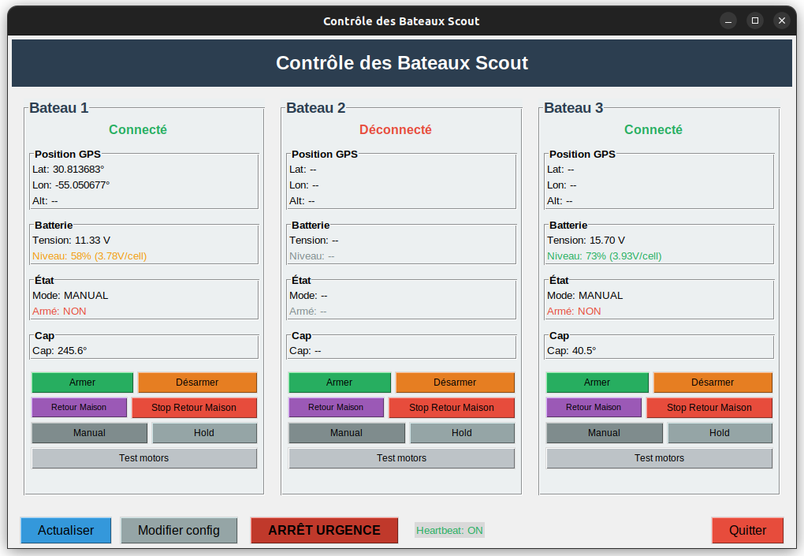
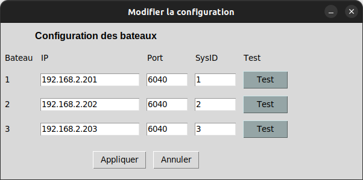

# Scout Guerlédan - Projet de navigation autonome multi-bateaux

## Présentation du projet

Ce projet vise à développer un système de contrôle et de navigation pour une flotte de bateaux autonomes (BlueBoat) évoluant sur le lac de Guerlédan. Le système permet de coordonner plusieurs scouts en formation, avec un bateau principal (MotherShip) et des bateaux suiveurs (ScoutA, ScoutB) qui maintiennent une formation géométrique (triangle équilatéral).

**Objectifs principaux :**

- Estimation d'état par méthodes ensemblistes (intervalles)
- Localisation en swarm
- Contrôle autonome d'USVs en swarm

## Installation et utilisation

### Prérequis

- Python 3.11+
- Bibliothèques Python :
  - `numpy==2.3.3` - Calculs numériques et manipulation de tableaux
  - `pymavlink==2.4.49` - Communication protocole MAVLink avec les bateaux
  - `requests==2.32.5` - Requêtes HTTP pour l'API REST
  - `matplotlib==3.10.7` - Visualisation et tracé de trajectoires
  - `codac==2.0.0.dev23` - Bibliothèque pour les calculs par intervalles et méthodes ensemblistes

- **VIBes-viewer** pour l'affichage des boîtes en simulation d'intervalles (via Codac)

### Installation

1. Cloner le dépôt :
```bash
git clone https://github.com/Quillianne/scout_guerledan.git
cd scout_guerledan
```

2. Installer les dépendances :
```bash
pip install -r requirements.txt
```

3. Installer VIBes-viewer si vous souhaitez l'affichage des boîtes :
```bash
# Releases : https://github.com/ENSTABretagneRobotics/VIBES/releases
```
La connexion au viewer se fait directement via Codac (pas de bibliothèque Python dédiée).

### Utilisation

#### 0. QGC et BlueOS

L'utilisation des bateaux requiert une phase d'initialisation (calibration, paramétrage des sécurités, etc.) qui s'opère via l'interface web du Blueboat. Celle-ci permet de configurer les endpoints MAVLink et les failsafes, ainsi que de calibrer les capteurs (IMU, compas).

Bien que QGroundControl (QGC) permette également d'effectuer ces calibrations, cet outil est surtout destiné à la supervision (état et position du bateau). Son usage impose la configuration d'un endpoint MAVLink dédié, ce qui peut s'avérer contraignant. Par conséquent, nous privilégions l'utilisation de MavlinkRest pour les autres interactions. Cet outil expose une API facilitant aussi bien la lecture des données que l'envoi de commandes MAVLink.

#### 1. Interface graphique de contrôle
Lancer l'interface pour monitorer et contrôler les bateaux :
```bash
python boat_control_gui.py
```


L'interface permet de :
- Visualiser position GPS, batterie, cap
- Armer/désarmer les bateaux
- Déclencher le retour maison
- Tester les moteurs
- Modifier IP/port/sysid via “Modifier config” :

La “config” correspond au fichier [boat_control_config.json](boat_control_config.json) qui décrit chaque bateau (host/IP, port mavlink2rest, sysid/compid). Elle est utilisée par l'interface et par les scripts (`--id`) pour charger automatiquement les bons paramètres de connexion.



- Maintenir les heartbeats pendant l'exécution

Le heartbeat évite le désarmement de sécurité : auparavant, si on lançait un script puis qu'on le fermait et relançait plus tard, les bateaux ne répondaient plus à cause du failsafe (passage en mode hold) car ils ne recevaient plus d'info. Le maintien du heartbeat prévient ce cas et au pire maintenant le gui permet maintenant le passage en mode manual.


#### 2. Différents tests

Il y a différents fichiers test_*.py qui permettent de tester séparément différents élements et permettent de vérifier que tout marche bien et aussi donne un exemple de comment utiliser le code. Certains peuvent avoir des fonctionnalités qui recouvrent celui d'un autre.

- [test_load_config.py](test_load_config.py) : charge la config et lit une fois l'IMU de chaque bateau.
  ```bash
  python test_load_config.py
  ```

- [test_bblib.py](test_bblib.py) : CLI de test de `bblib` (IMU, GPS, batterie, arm, commandes moteurs, cap, modes).
  ```bash
  python test_bblib.py --id 1 imu
  python test_bblib.py --id 1 gps
  python test_bblib.py --id 1 arm 1
  python test_bblib.py --id 1 drive --left 120 --right 120 --secs 2
  python test_bblib.py --id 1 set_mode --mode MANUAL
  ```

- [test_mavlinkrest.py](test_mavlinkrest.py) : CLI MAVLink2Rest direct (arm, neutral, drive, imu, gps).
  ```bash
  python test_mavlinkrest.py --id 1 imu
  python test_mavlinkrest.py --id 1 gps
  python test_mavlinkrest.py --id 1 drive --left 100 --right 100 --secs 2
  ```

- [test_set_mode_manual.py](test_set_mode_manual.py) : change le mode de vol via la config.
  ```bash
  python test_set_mode_manual.py --id 1 --mode MANUAL
  ```

- [test_multiple_boat.py](test_multiple_boat.py) : test multi-bateaux (2 bateaux). Le bateau 2 suit un cap, le bateau 3 le poursuit.
  ```bash
  python test_multiple_boat.py
  ```

- [test_formation_triangle.py](test_formation_triangle.py) : formation triangle (3 bateaux) avec cible calculée depuis le mothership.
  ```bash
  python test_formation_triangle.py
  ```

- [test_display.py](test_display.py) : simulation intervalle + VIBes (FleetPredictor) avec scénarios d'évasion.
  ```bash
  python test_display.py
  ```

#### 3. Visualisation et log en temps réel de la flotte en utilisant les intervalles

Ce script utilise l'observateur par intervalles et enregistre un log des positions.

**Live (bateaux réels)**
```bash
python observer_logger.py
```
- Ouvre un affichage VIBes (si VIBes-viewer est lancé).
- Écrit deux fichiers de log :
  - `test_observer.log` (dernier run)
  - `logs/test_observer_YYYYMMDD_HHMMSS.log` (horodaté)

**Replay (à partir d'un log)**
```bash
python observer_logger.py --replay logs/test_observer_YYYYMMDD_HHMMSS.log
```
Options utiles :
- `--speed 2` : rejouer 2x plus vite.
- `--downsample 2` : 1 point sur 2.
- `--only-plot` : pas de VIBes, uniquement les courbes de taille des boîtes.

Note : en live, l'affichage est mis à jour moins souvent que le log. Le log enregistre 5x plus de points que ceux utilisés pour l'affichage, donc utilisez `--downsample 5` pour des conditions similaires au live.

Exemple :
```bash
python observer_logger.py --replay logs/test_observer_20250205_123456.log --speed 2 --downsample 2 --only-plot
```


#### 4. Simulation avec intervalles + VIBes-viewer
Simulation de flotte + affichage VIBes-viewer (Codac) :
```bash
python test_display.py
```

#### 5. Beautiful Replay (Django)
Interface web pour rejouer un log avec carte, contrôles de lecture, et affichage des boîtes/pavages.

Depuis le dossier [beautiful_replay/](beautiful_replay) :
```bash
python manage.py migrate  # uniquement la première fois
python manage.py runserver
```
Puis ouvrir http://127.0.0.1:8000

Le bouton “Visualiser” ouvre le lecteur. “Changer de log” ré-affiche la fenêtre de configuration (log, downsample, incertitudes, mode récursif).


## Structure du projet

### Dossiers principaux

#### [`utils/`](utils/)
Modules utilitaires pour la communication et la gestion des bateaux.

- [`bblib.py`](utils/bblib.py) : Bibliothèque principale pour communication MAVLink et contrôle des bateaux
- [`geo_conversion.py`](utils/geo_conversion.py) : Conversions géographiques (WGS84 ↔ NED)
- [`interval.md`](utils/interval.md) : Documentation des contracteurs équivalents / formules
- [`settings.py`](utils/settings.py) : Configuration globale du projet
- [`prediction.py`](utils/prediction.py) : Classe et fonctions de prédiction et estimation de trajectoires
- [`fleet_prediction.py`](utils/fleet_prediction.py) : Prédiction/estimation de flotte (3 bateaux) avec contraintes de distance et mouvements. Possibilité de mettre en mode récursif ou non
- [`vibes_display.py`](utils/vibes_display.py) : Affichage et visualisation avec VIBes-viewer

#### [`logs/`](logs/)
Logs des missions (celles avec observation par intervalles). Ils sont ordonnés par date et heure.

#### [`beautiful_replay/`](beautiful_replay/)
Application Django de replay visuel (carte, lecture/pause/vitesse, boîtes et pavages via `FleetPredictor`).

#### [`figures/`](figures/)

- [`trajectoires_analyse_complete.png`](trajectoires_analyse_complete.png) : Visualisation complète des trajectoires enregistrées lors de la première semaine
- [`box_sizes_escape.png`](box_sizes_escape.png), [`box_sizes_no_escape.png`](box_sizes_no_escape.png) : Analyses de la taille des boîtes englobantes avec et sans la manoeuvre pour casser la symétrie
- [`compute_times_reset.png`](compute_times_reset.png), [`compute_times_no_reset.png`](compute_times_no_reset.png) : Analyses des temps de calcul en faisant le reset de la chaine de contracteur ou non.


## Ressources

- Vidéos de démonstration : https://drive.google.com/drive/folders/1pT9_0SwZHuyaDzCsY3-wl783lb_Jlr6z?usp=drive_link
- Documentation Codac : https://codac.io/
- Protocole MAVLink : https://mavlink.io/

## 👥 Contributeurs

- Kilian BARANTAL
- Aurèle PLANCHARD
- Ewen MELE
