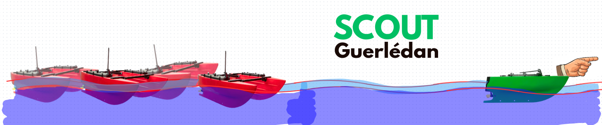

# Scout Guerlédan - Projet de navigation autonome multi-bateaux

## Présentation du projet

Ce projet vise à développer un système de contrôle et de navigation pour une flotte de bateaux autonomes (BlueBoat) évoluant sur le lac de Guerlédan. Le système permet de coordonner plusieurs scouts en formation, avec un bateau principal (MotherShip) et des bateaux suiveurs (ScoutA, ScoutB) qui maintiennent une formation géométrique (triangle équilatéral).

**Objectifs principaux :**

- Estimation d'état par méthodes ensemblistes (intervalles)
- Localisation en swarm
- Contrôle autonome d'USVs en swarm

## Installation et utilisation

### Prérequis

- Python 3.8+
- Bibliothèques Python :
  - `numpy==2.3.3` - Calculs numériques et manipulation de tableaux
  - `pymavlink==2.4.49` - Communication protocole MAVLink avec les bateaux
  - `requests==2.32.5` - Requêtes HTTP pour l'API REST
  - `matplotlib==3.10.7` - Visualisation et tracé de trajectoires
  - `codac` - Bibliothèque pour les calculs par intervalles et méthodes ensemblistes

### Installation

1. Cloner le dépôt :
```bash
git clone https://github.com/Quillianne/scout_guerledan.git
cd scout_guerledan
```

2. Installer les dépendances :
```bash
pip install -r requirements.txt
```

3. Installer Codac (pour les méthodes ensemblistes) :
```bash
# Suivre les instructions sur : https://codac.io/
```

### Utilisation

#### 1. Interface graphique de contrôle
Lancer l'interface pour monitorer et contrôler les bateaux :
```bash
python boat_control_gui.py
```

L'interface permet de :
- Visualiser position GPS, batterie, cap
- Armer/désarmer les bateaux
- Déclencher le retour maison

#### 2. Tests de formation en triangle
Tester la formation géométrique avec bateaux réels :
```bash
python test_formation_triangle.py
```

#### 3. Simulation
Tester les algorithmes en simulation avant déploiement :
```bash
python Sim/Simulation.py
```

#### 4. Simulation avec intervalles
Tester l'estimation d'état par méthodes ensemblistes :
```bash
cd Sim
python interval_test.py
```

### Configuration

Modifier les adresses IP et paramètres dans les scripts de test ou dans `utils/settings.py` :
```python
MOTHERSHIP_IP = "192.168.1.1"
SCOUT_A_IP = "192.168.2.202"
SCOUT_B_IP = "192.168.2.203"
PORT = 6040
```

## Structure du projet

### Dossiers principaux

#### `Interval/`
Contient l'implémentation des méthodes d'estimation par intervalles utilisant la bibliothèque Codac.

- **`scout_intervalle/`** : Package principal pour la gestion de flotte avec intervalles
  - `controller.py` : Contrôleurs pour le pilotage des bateaux

#### `Sim/`
[Old] Premier simulateur de bateaux  pour tester les algorithmes de contrôles sans intervalles avant déploiement.

- `Boat.py` : Modèle cinématique de bateau
- `Controller.py` : Contrôleurs (cap-vers-point, cap-constant, etc.)
- `Path_planner.py` : Planification des points de passage pour formations
- `Simulation.py` : Moteur de simulation avec visualisation matplotlib

Premiers algorithmes par intervalles qui ne marchent pas:
- `Simulation _intervals.py` : Simulation avec estimation par intervalles
- `Interval_observer.py` : Observateur d'état par intervalles

#### `utils/`
Modules utilitaires pour la communication et la gestion des bateaux.

- `bblib.py` : Bibliothèque principale pour communication MAVLink avec BlueBoat
- `geo_conversion.py` : Conversions géographiques (WGS84 ↔ NED)
- `settings.py` : Configuration globale du projet
- `prediction.py` : Algorithmes de prédiction et estimation de trajectoires
- `vibes_display.py` : Affichage et visualisation avec VIBes
- `test_display.py` : Tests pour les fonctions de visualisation

### Scripts principaux

- `boat_control_gui.py` : Interface graphique de monitoring et contrôle des bateaux
- `heartbeat.py` : Gestion des heartbeats MAVLink pour maintenir les connexions

Scripts de test pour différentes fonctionnalités :
  - `test_bblib.py` : Tests de la bibliothèque MAVLink
  - `test_formation_triangle.py` : Test de formation en triangle
  - `test_mavlinkrest.py` : Tests API REST MAVLink
  - `test_multiple_boat.py` : Tests multi-bateaux

### Fichiers d'analyse

- `trajectoires_analyse_complete.png` : Visualisation complète des trajectoires
- `box_sizes_escape.png`, `box_sizes_no_escape.png` : Analyses de la taille des boîtes englobantes
- `compute_times_reset.png`, `compute_times_no_reset.png` : Analyses des temps de calcul


## Ressources

- Vidéos de démonstration : https://drive.google.com/drive/folders/1pT9_0SwZHuyaDzCsY3-wl783lb_Jlr6z?usp=drive_link
- Documentation Codac : https://codac.io/
- Protocole MAVLink : https://mavlink.io/

## 👥 Contributeurs

- Kilian BARANTAL
- Ewen MÉLÉE
- Aurèle PLANCHARD
